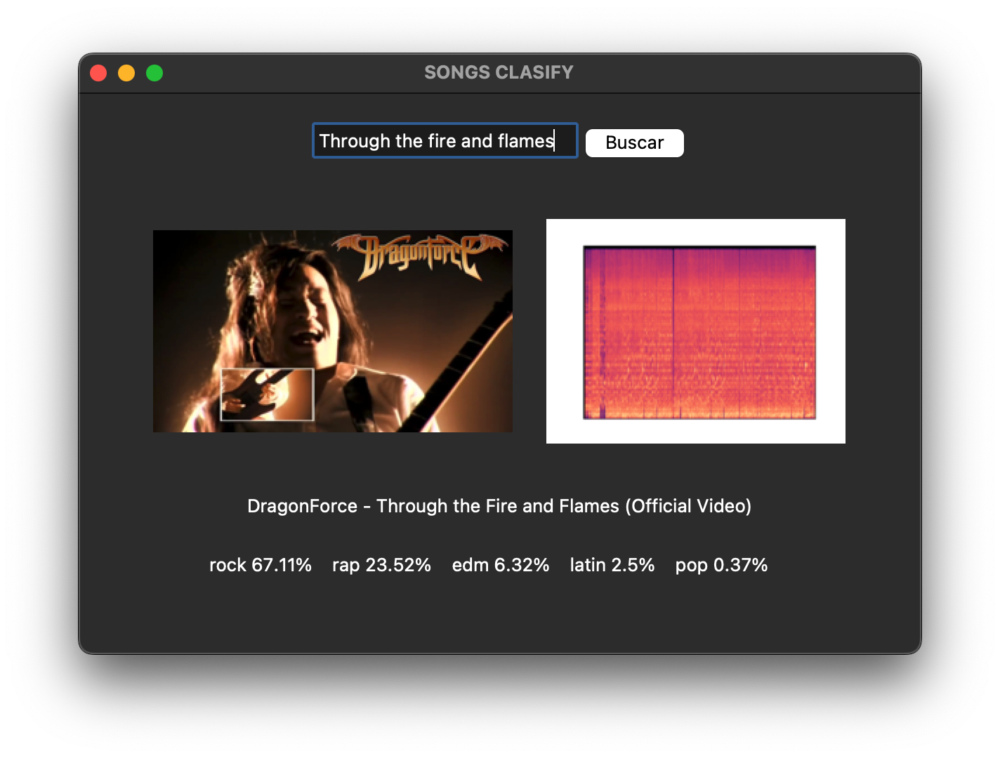
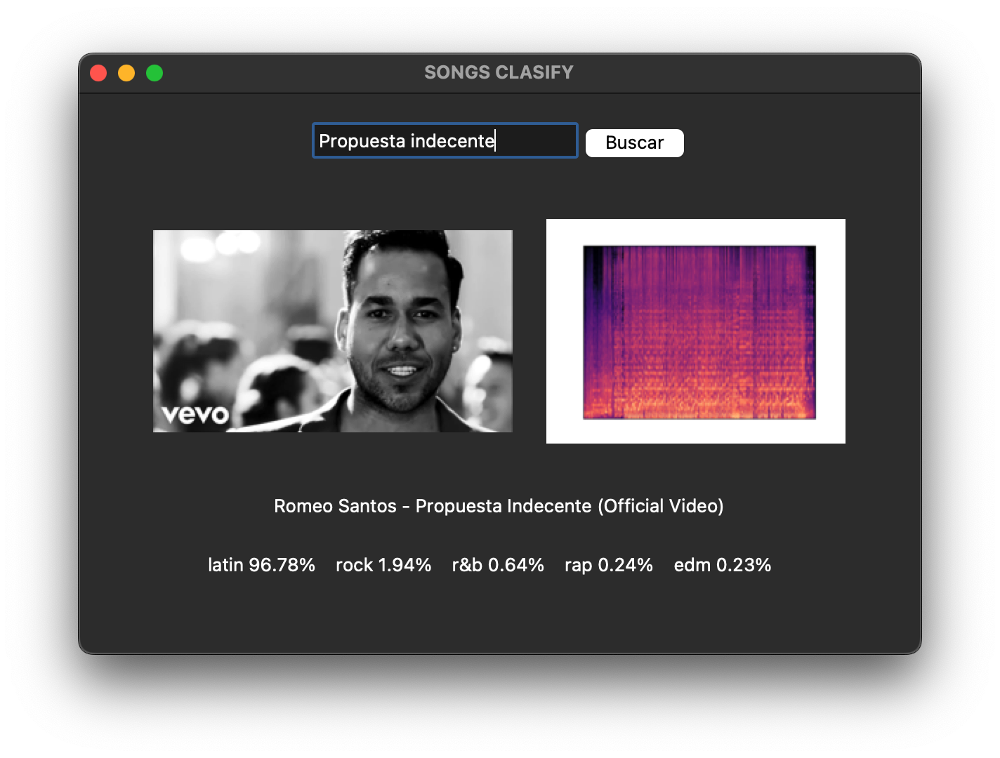
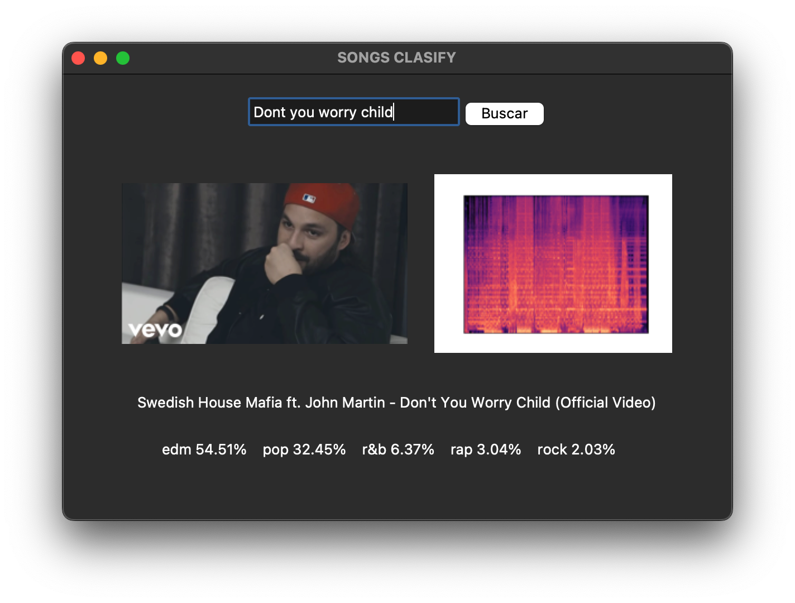
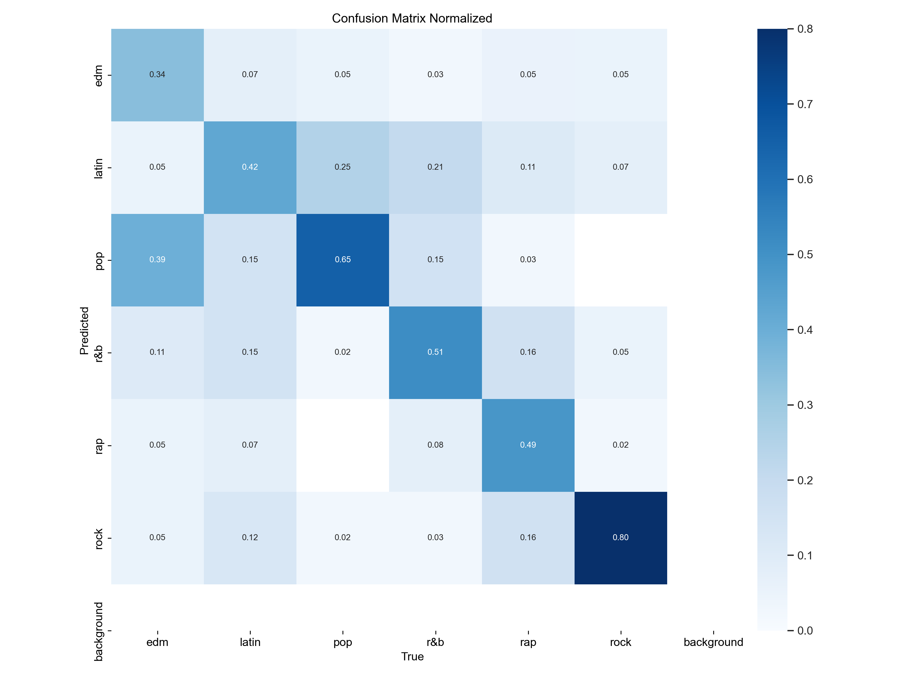

# songs-classifier
Clasificador de canciones por género usando espectrogramas y visión artificial.

Se ha entrenado un modelo YOLOv11 con un conjunto de datos de 1200 imágenes de espectrogramas de diversas canciones.
Se utilizó la lista de canciones "spotify_songs.csv" como fuente principal de datos. Se descargaron los audios de YouTube correspondientes a las canciones en la lista. Se generaron espectrogramas a partir de los archivos de audio descargados. Se utilizó la arquitectura YOLOv11 para el entrenamiento del modelo de detección de objetos. El modelo fue entrenado con el conjunto de datos de espectrogramas y ajustado para clasificar las canciones en diferentes géneros musicales.
Adicionalmente se desarrolló una pequeña aplicación de escritorio utilizando la biblioteca Tkinter de Python. Esta aplicación permite a los usuarios buscar canciones en YouTube y obtener los géneros musicales relacionados. 

  
  
  

La música es muy variada y las canciones casi nunca se ciñen a un solo género musical. Es común que una misma canción tenga elementos de varios géneros diferentes, lo que se refleja en los espectrogramas como una mezcla de patrones de sonido. Esto hace que sea complicado para un programa identificar de forma clara a qué género pertenece una canción. Esta complejidad plantea desafíos significativos para el modelo de clasificación basado en espectrogramas. El modelo debe ser capaz de identificar y diferenciar los patrones acústicos que se corresponden con múltiples géneros, así como de diferenciar cuáles son los más relevantes para la clasificación final de la canción. 
Dicha complejidad a la hora de clasificar las canciones se ve reflejada en la matriz de confusionismos obtenida tras el entrenamiento del modelo:

  

## Instalación
-Crear un entorno virtual de python (versión utilizada 3.9.6) 
-Instalar las bibliotecas del fichero "requirements.txt" 
-Ejecutar "main.py"
